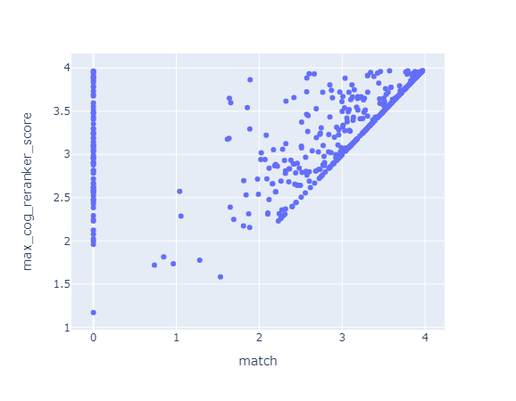

**Observations of Cog Search Semantic Reranker Score Experiments**

We wanted to understand whether there is any value in limiting the low quality chunks (if any) sent to LLM by using the cog search semantic reranker score which can be returned for each chunk. Semantic ranking score is a value between 0.00 - 4.00

To do so we made the changes Domain Services to filter the results sent to LLM based on the semantic reranker score and added a new domain configuration.
```
ai_threshold (default 0, if not set)
```
 The dataset and groundtruth used was the cckm_3700-v3 of ~3900 articles/457 questions. 
 Dataset : cckm_3700 v3

 Defaults:
 ```
  "index_definition": {
    "semantic_configuration_name": "semantic_configuration"
  },
 "embedding_model_class": "TransformerEmbeddings",
  "embedding_class_args": {
    "tokenizer_path": "tokenizer-msmarco-bert-base-dpr-v5-updated",
    "document_embedding_path": "onnx-msmarco-bert-base-dot-v5",
    "query_embedding_path": "onnx-msmarco-bert-base-dpr-v5"
  },
  "file_loader_class_name": "JSONLoaderWithHtml",
  "splitter_class_name": "RecursiveCharacterTextSplitter",
  "splitter_kwargs": {
    "chunk_size": 1500,
    "chunk_overlap": 375
  },
  "chain_type": "stuff",
  "loader_kwargs": {
    "content_key": "BW_Article_Details__c",
    "jq_schema": ".",
    "metadata_func": "care_metadata",
    "text_content": false
  },
  "k_milvus": 20,
  "search_db_type": "azure_cognitive_search",
  "prompt": "You are a helpful AI assistant whose primary goal is to help AT&T customer support agents using a provided context. Use the context delimited by triple backticks to answer the question at the end. Provide step by step instructions if available. First find the relevant information and then answer the question based on the relevant information. DO NOT ANSWER any question outside of the provided context. \n```{context}```\n\nQuestion: {question}?\n Helpful Answer:"
  ``` 

**Impact of ai_threshold**

**Sample run with ai_threshold = 2

| **No.** | **Experiment ID**      |**ai_Threshold**| **No. of empty context** |              **GPT4 metric>5%**|
|---------|------|-------|-|-|
| 1       | e0abc086-d072-4d48-846c-f1983cf94a5c | 2                                   | 8                     |83.9

On looking at the results.csv we noticed that although we are not sending any context to the LLM (init_chunks = []) for 8 questions, the LLM was returning a detailed answer.
```
[10030, 10149, 20122, 20149, 30149, 50029, 50037, 50049]

Example 1:
Q: What can AOP's do?
A: Can place orders or make billing account changes.
May not request changes to a FAN profile except to:
o	Update their own name and contact information
o	Add a FAN Contact PIN to their contact information
o	Update the Do Not Solicit indicator on their contact profile

Generated Answer:
AOPs, or Authorized Order Placers, are individuals who are authorized to place orders on behalf of AT&T customers. They have the ability to perform various tasks related to order placement and management. Some of the things that AOPs can do include:

1. Placing new orders for AT&T products and services.
2. Modifying existing orders, such as adding or removing services.
3. Checking the status of orders and providing updates to customers.
4. Cancelling orders if necessary.
5. Assisting customers with any issues or questions related to their orders.

Please note that the specific tasks and permissions of AOPs may vary depending on their level of authorization and the tools they have access to. It is always recommended to consult the AT&T internal resources or supervisor for detailed instructions on how to perform specific tasks as an AOP.
```
Further analysis showed that 5 of them had infact GPT4-32K score above 5. Clearly the model was having some intrinsic knowledge and not just the context that was being passed in. Since we do not want any answers at all outside the context passed in we changed a few prompts following the guidelines in [this article](https://www.makeuseof.com/how-to-reduce-ai-hallucination/). Having an **According to** ensures that only the provided Context is used.

```
"You are a helpful AI assistant whose primary goal is to help AT&T call support agents who support calls from AT&T enterprise customers. ***According to***, \n Context: {context}, \n what is the answer to the \n Question: {question}. \n Provide step by step instructions if available. Do not attempt to answer if the Context provided is empty. Ask them to elaborate the question instead."
```
After making the change all of the same 8 Ids now returned below: (Experiment Id: ffd31caa-5217-40ce-b303-e2af74001d02)
```
I'm sorry, but the provided context is empty. Could you please provide more information or elaborate on your question? This will help me better understand your inquiry and provide you with the most accurate answer or guidance.
```
Also, the GPT4 metric seems inline with the in_top_init metric after this change because it no longer uses the intrinsic LLM knowledge.

*All the experiments hence forth are based on the new prompt*. The new default prompt has been updated and checked-in.


**Experiment ID**      |**ai_Threshold**| **No. of empty context** |  **in_top_init%**|**init_rougeL_recall_median%**|            **GPT4 metric>5%**| **chat_query_time_in_sec_median**|**No. of chunks sent to LLM**
|---------|------|-------|-|-|-|-|-|
ff8a722a-0cdf-4d2a-817e-fbc4c61fe18d                          | 0(default)               | 0 |     83.2|91.4       |         84.6|5.21|9100
21eb95ef-ca05-464b-80bc-aea87f763509  | 1                                   | 0 |82.6|91                  |81.7|5.51|8744
ffd31caa-5217-40ce-b303-e2af74001d02                         | 2               | 8 |     78.2 |88.4      |         79.7|5.19|5807

As expected as you increase the threshold, the chunks that meet that criteria reduce and hence the context passed in reduces. The recall and the in_top drops. 

We added the following metrics to the experimentation framework to have an idea of the best cog search reranker score so that we can better understand our ground truth quality. The [analysis notebook](./analysis.ipynb) has the corresponding best article details.

results.csv
- max_cog_reranker_score (Maximum reranker score among the k_milvus chunks)

**Ground Truth Article Reranker Score Distribution**


- Scores were set 0 for articles that were not returned (since we don't get a reranker score in those cases)
- We can see that roughly 20% of the articles have a score < 2. 

**Ground Truth Article Reranker Score - Best Reranker Score Scatter**


- we can observe that in majority of the cases the ground truth article score is slighlty less that the max reranker score.


**Conclusion**

This was a good exercise in evaluating our ground truth, search results and LLM answers. It helped identify hallucination and bad Q&A. However, we knew from our prior experiments that the more chunks we send the better the chances of improving the in top and recall. We see the same behavior here as well. Since the LLM is able to find the answer if present irrespective of the amount sent, reducing the chunks is not necessary. Hence no changes will be made to the default configuration. But the parameters will be available to facilitate the construction of good ground truth and content. But in future, if we want to evaluate the cost/token constraints it might be a good idea to set the threshold, based on the score distribution exercise if we want to take a small hit on the recall but save on cost or improve the performance. 

**References**

1. [Azure AI search ranking](https://learn.microsoft.com/en-us/azure/search/hybrid-search-ranking)

