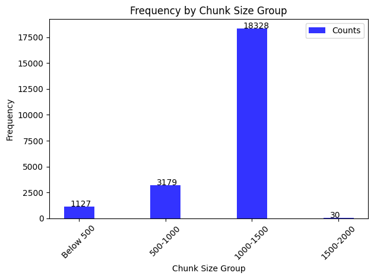
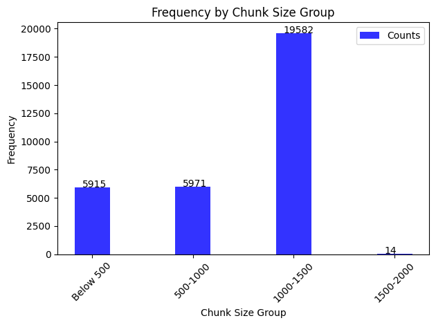

# Impact of Custom HTML loader and Splitter changes

## Hypothesis

Goal of this experiment is to understand the impact of custom preprocessing of the raw HTML content and chunking of the content using custom HTMLSectionSplitter.

Also compare the results of the traditional recursive splitter with the custom HTML section splitter and then come up with observations and suggestions for improvements.

## Background

### Preprocessing with JSONLoaderWithHtml

In [JSONLoaderWithHtml](https://dev.azure.com/ACC-Azure-04/CDO-Data-Illuminate/_git/AskATT_DomainServices?path=/loaders/json_loader.py),
there is a new `html_tags_to_unwrap` property which holds a list of HTML tags to unwrap. This means that a specified HTML tag will be
removed leaving the content intact.

Here is an example of using the `html_tags_to_unwrap`:

```json
"file_loader_class_name": "JSONLoaderWithHtml", "loader_kwargs": { ..., "text_content": false, "remove_all_tags": false, "html_tags_to_unwrap": ["h4", "h5", "h6", "a", "span", "em"]},
```

### Html Section Text Splitter

The [new HTML Section Text Splitter](https://dev.azure.com/ACC-Azure-04/CDO-Data-Illuminate/_git/AskATT_DomainServices?path=/utility/splitters/html_section_splitter.py&version=GBdevelop&_a=contents) has been implemented in DomainServices.

This custom text splitter exposes the `headers_to_split` property, which given a list of headers, the documents will be split by these headers (if found any).

Once these split documents has been generated, there will be a second split by the `RecursiveCharacterTextSplitter` from langChain if necessary i.e if the section exceeds the character/token limit.

To enable it, you can update the domain configuration with a few optional arguments as the following: 

```json
"splitter_class_name": "HTMLSectionSplitter", "splitter_kwargs": {"chunk_size": 1500, "chunk_overlap": 375, "headers_to_split_on": [["h1", "Header 1"], ["h2", "Header 2"], ["h3", "Header 3"]]},
```

To learn more about this, go [here](https://dev.azure.com/ACC-Azure-04/CDO-Data-Illuminate/_git/AskATT_DomainServices?path=/docs/design/html-loader-splitter.m)

## Approach

Any text splitter config change will affect the chunk size and retrieval of the documents, so following metrics were considered:

- Chunk size
- In top init%
- Init RougeL recall

The set of experiments are based on the new features of `JSONLoaderWithHtml` and `HTMLSectionSplitter`.

**Note**: There is a [Jupyter Notebook](./analysis.ipynb) to identify the below data points. It can be used to extract full list of article IDs and chunks for futher analysis.

Initially `HTMLSectionSplitter` with `CharacterTextSplitter` was used to split the text into sections, but some issues were noticed and it was decided to switch to `HTMLSectionSplitter` with `RecursiveCharacterTextSplitter` instead. The reasons for this change are explained below. All the results were analysed and documented. Finally conclusions were drawn.

## Initial Experiments with CharacterSplitter

Started with different seperator combinations to figure the effect on data.

Results:

|experiment_id| domain configuration |chunk_size_median|chunk_size_mean|chunk_size_min|chunk_size_max|in_top_init_%|init_rougeL_recall_median|
|-------------|----------------------|-----------------|-------------------------|----------|----------|----------|----------------------------------|
|33d642c4-3f36-421f-b28f-e032446f50f0 (**baseline**)|--|1371|1231.32|2|1500|0.835164|0.91176|
|e612813d-769f-4002-b63a-6fb7a5ef522b|Use separator: [.\n]+|1413.0|1166|1|24562|0.78193|0.87891|
|f11a20fb-5a0a-4a93-b91c-360ab5311f01|Use separator:'\n'.|1387.0|1371|3|63179|0.77041|0.9225|
|689bfc78-939a-4c90-8598-117e09fdc457|Use separator: [.\n ]+|1493.0|1293|1|1500|0.64757|0.63927|

### Observation 1.

The chunk sizes increased as the number of separators decreased. This is by design.

Providing more separators [.\n ]+ improved the chunk sizes, but worsened the metrics and the response data. So, it was decided to explore `RecursiveCharacterTextSplitter` instead of `CharacterTextSplitter`.

`baseline_results.csv` and `689bfc78-939a-4c90-8598-117e09fdc457.csv` for instance was looked at to analyse the `in_top_init` metric.
Comparing the baseline and the experiment results, `in_top_init` values changed. Some records that were not in the top initial retrieval results in the baseline became part of it in the experiment, and some records that were in the top initial retrieval results in the baseline dropped out of it in the experiment. The number of records with 0 in the `in_top_init` column increased from 75 in the baseline to 160 in the experiment.

### Observation 2(Bug found). Separator characters are included in the resulting chunks of text

Experiments that utilize the regex separator as part of the `CharacterTextSplitter` are including the separator in the chunk text.

For example, in the results.csv file for the experiment ID `689bfc78-939a-4c90-8598-117e09fdc457`, observe that the separator is included whenever the regex matches. Here’s what it looks like:

```text
[('to[.\n ]+confirm[.\n ]+there[.\n ]+have[.\n ]+been[.\n ]+no[.\n ]+recent[.\n ]+changed[.\n ]+in[.\n ]+service[.\n ]+provisioning[.\n ]+Access[.\n ]+GEOLink[.\n ]+to[.\n ]+confirm[.\n ]+there[.\n ]+are[.\n ]+no[.\n ]+network[.\n ]+outages[.\n ]+impacting[.\n ]+the[.\n ]+customer[.\n ]+Check[.\n ]+for[.\n ]+known[.\n ]+issues[.\n ]+that[.\n ]+could[.\n ]+be[.\n ]+impacting[.\n ]+this[.\n ]+customer[.\n ]+\t[.\n ]+Device[.\n ]+Issues[.\n ]+Log[.\n ]+Trending[.\n ]+Issue[.\n ]+Tracker[.\n ]+If[.\n ]+none[.\n ]+of[.\n ]+the[.\n ]+above[.\n ]+resolve[.\n ]+the[.\n ]+customer's[.\n ]+issue,[.\n ]+follow[.\n ]+local[.\n ]+center[.\n ]+process[.\n ]+for[.\n ]+opening[.\n ]+ICU[.\n ]+Ticket[.\n ]+on[.\n ]+customer's[.\n ]+behalf[.\n ]+Voicemail[.\n ]+I'm[.\n ]+having[.\n ]+trouble[.\n ]+setting[.\n ]+up[.\n ]+voicemail[.\n ]+Note:[.\n ]+There[.\n ]+is[.\n ]+a[.\n ]+known[.\n ]+issue[.\n ]+impacting[.\n ]+some[.\n ]+Family[.\n ]+Setup[.\n ]+for[.\n ]+Apple[.\n ]+Watch[.\n ]+customer's[.\n ]+ability[.\n ]+to[.\n ]+setup[.\n ]+voicemail[.\n ]+Refer[.\n ]+to[.\n ]+Service[.\n ]+Issue[.\n ]+Log[.\n ]+(SILog)[.\n ]+>[.\n ]+Customers[.\n ]+on[.\n ]+stand[.\n ]+alone[.\n ]+unlimited[.\n ]+plan[.\n ]+(WEARIWUNL)[.\n ]+cannot[.\n ]+send[.\n ]+messages[.\n ]+or[.\n ]+set[.\n ]+up[.\n ]+voicemail[.\n ]+(link[.\n ]+not[.\n ]+visible[.\n ]+to[.\n ]+ISM[.\n ]+-[.\n ]+Credit,[.\n ]+NR[.\n ]+-[.\n ]+External[.\n ]+and[.\n ]+DIRECTV)[.\n ]+for[.\n ]+addition[.\n ]+details[.\n ]+and[.\n ]+resolution[.\n ]+steps[.\n ]+Non-Technical[.\n ]+Call[.\n ]+Takers[.\n ]+If[.\n ]+this[.\n ]+is[.\n ]+not[.\n ]+the[.\n ]+customer's[.\n ]+issue ...
```

## Experiments with RecursiveCharacterTextSplitter

Domain configs used for experimentation and results observations:

|experiment_id| domain configuration |chunk_size_median|chunk_size_mean|chunk_size_min|chunk_size_max|in_top_init_%|init_rougeL_recall_median|GPT metric|
|-------------|----------------------|-----------------|-------------------------|----------|----------|----------|----------------------------------|--|
|33d642c4-3f36-421f-b28f-e032446f50f0 (**baseline**)| Use default config|1371|1231.32|2|1500|0.835164|0.91176|--|
|d26968c1-73f0-402a-8bea-92cc597df25e|unwrapped tags as p, li, h4, h5, h6, ul, ol, a, span, div and no remove_all_tags; chunk_size 1400, chunk overlap 350 and seperators - \n, ., space |1167|972|1|1400|0.791208791|0.9|--|
|8071308c-7db8-4c85-a9ab-a4a0e29f8f33|unwrapped tags as p, li, h4, h5, h6, ul, ol, a, span, div and no remove_all_tags; chunk_size 1500, chunk overlap 375 and headers split on - h1, h2, h3 and default seperators|1250|1040|1|1500|0.78681|0.91666|--|
|6f33149e-f7c8-4c69-8dfc-dfdd1e8a08f5(GPT 3.5)|unwrapped tags as p, li, h4, h5, h6, ul, ol, a, span, div and no remove_all_tags; chunk_size 1500, chunk overlap 375 and headers split on - h1, h2, h3 and default seperators using GPT 3.5|1253.0|1042|1|1500|0.7890|0.9225|~0.89|

## chunk size distribution

The baseline and experimentation chunk size dstribution was looked at to see how the splitter effects and was almost comparable -

Baseline - 



Experiment 1 -



Experiment with GPT 3.5 -


## Analysis on in_top_init%

### Observation 1. There are more rows with in_top_init as zero.

For most experiments, where the `in_top_init%` was lower than 0.80, it was observed more number of rows having `in_top_init` value as 0 in results.csv.

To understand what these metrics really mean, a couple of results.csv files for the respective experiments were looked at for `in_top_init`.

|Question|Expected answer|Baseline answer|Baseline in_top_init|Experiment Answer|Experiment in_top_init|Observation|
|--------|---------------|---------------|--------------------|-----------------|----------------------|-----------|
|What countries are eligible for the International Day Pass?|See att.com/globalcountries.|To find the list of countries eligible for the International Day Pass, you can visit the AT&T International Day Pass destinations page at att.com/globalcountries.|0|International Day Pass covers 210+ destinations. To see the list of AT&T International Day Pass destinations, you can visit the AT&T website or check the provided information by the customer support agent.|1|Was able to find source but answer seems to be incomplete for experimentation. Observed that the seperators config can interefere with the information chunked.For instance the chunked had this - `go to att[.\n]+com/globalcountries[.\n]`, the LLM seems to not have picked the piece of info that is picked otherwise by the baelines LLM.|
|How long must an account be active in order to complete a ToBR?|The current account must be active for a minimum of two months (60 days) service to be eligible for a ToBR.|An account must be active for a minimum of two months (60 days) in order to be eligible for a ToBR.|2|An account must be active for more than 60 days in order to complete a ToBR.|0|There seem to multiple sources for the question and hence the count is 0 as the source picked for experimentation is different|
|Can I add a line to the AT&T Mobile Share Plus for Business?|AT&T will not accept orders for new services, add-a-lines, and rate plan changes. However, AT&T will continue to allow our existing customers on these plans if groups have not reached the maximum lines allowed.|As of December 14, 2022, Mobile Share Plus for Business plans are on a sales hold. AT&T will not accept orders for new services, add-a-lines, and rate plan changes. However, existing customers on these plans can continue to use them if groups have not reached the maximum lines allowed.|5|Yes, you can add a line to the AT&T Mobile Share Plus for Business plan. To do so, you can log into your account on the AT&T Premier platform and follow the steps to add a new line. You can choose from the available plans, such as Unlimited Premium, Extra, and Starter, to find the best fit for your needs.|0|The answer in the experimentation seems to be accurate from the chunk that was extracted. Which is interesting because seems to be multiple source information is available for the question|

From the observation, the `in_top_init%` decrease in experimentation can mean:
1. chunked data doesnt have enough information
2. multiple source information, which seemed to be for lots of cases 

experiment_id|% of in_top_init with zeros
-------------|---------------------------
33d642c4-3f36-421f-b28f-e032446f50f0 (baseline) | 15% (75 questions)
d26968c1-73f0-402a-8bea-92cc597df25e | ~21% (95 questions)
8071308c-7db8-4c85-a9ab-a4a0e29f8f33 | 21% (97 questions)
6f33149e-f7c8-4c69-8dfc-dfdd1e8a08f5 | 21% (96 questions)

From the analysis, a huge improvement was not noticed in terms of the generated answers as well as the `in_top_init metric`. 

**Note: For future** if this metric will be used to make a decision then it needs to be made sure the `source` defined is accurate and need to consider multiple source use case as well.

## Analysis of RougeL Recall

From the various experiment runs, the `init_rougel_recall_median` did not improve either compared to the baseline.

## Conclusions

- From the various experimentation runs, it was noticed that there was not significant improvement in terms of the response (generated answers) or the metrics. Hence, would recommend to use the traditional recursive splitter for now and explore HTML sectionsplitter when there is a need for it.

- A bug was found for `CharacterTextSplitter` - The separator config value affects the vector store content. For instance this is a sample of the chunked data where seperator config value is added - `go to att[.\n]+com/globalcountries[.\n]`.

- `in_top_init` metric measure needs more review and analysis because there are multiple source scenarios. Also, the experimentation runs will result in a zero value because the source name is different than provided in the ground truth.